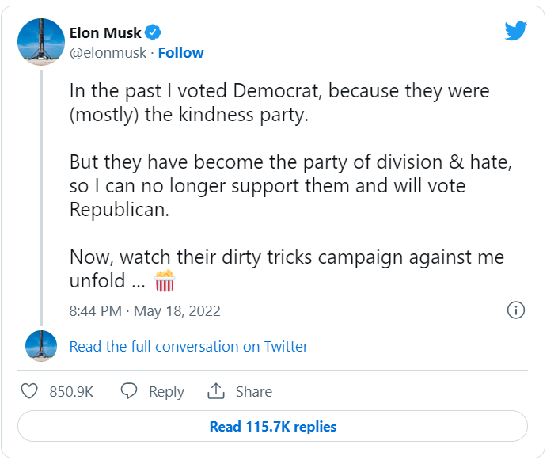

```{r setup, include=FALSE, echo=FALSE}
knitr::opts_chunk$set(echo=TRUE, error=FALSE, message=FALSE, warning=FALSE)
```

```{r, out.height = "350px"}

```

# Introduction

In this project, political discussions on the famous social-news-platform Reddit are explored with the use of Natural Language Processing. For this purpose, I used the dataset "Liberals vs Conservatives on Reddit" from Kaggle, which you can find [here](hhttps://www.kaggle.com/datasets/neelgajare/liberals-vs-conservatives-on-reddit-13000-posts?select=file_name.csv). The dataset contains political posts from users which were classified as Liberals or Conservatives.  

The goal of this projects is to find some interesting patterns in what and how more Liberal-leaning users and more Conservative-leaning users are discussing online.

# Preperations {.tabset}

## Load Packages

First, relevant packages are loaded. We load a range of libraries for general data wrangling and general visualization together with more specialized tools for Natural Language Processing.


```{r}
#load packages
library(here) #used for folder navigation
library(tidyverse) #loading packages from tidyverse
library(tidytext) #used for natural language processing
library(ggthemes) #used for graphic specifics
library(skimr) #used to get fist overview of dataset
library(janitor) #used to clean variable names
library(textdata) #used for sentiment analyses
library(gridExtra) #used to arrange plots in grid with grid.arrange
library(grid) #used to alter size and position of title within grid.arrange
library(ggpubr) #used for lollipop chart
library(scales) #used to show percentage format in charts
library(knitr) #used for table formatting
```

## Load Data

The data was downloaded from Kaggle and stored locally (login necessary). The here package is used to locate the files relative to the project root. The clean_names() function from the janitor package is used to make clear variable names.

```{r Loading Data}
#load data
reddit_data <- read_csv(here("Data/file_name.csv"))
names(reddit_data) <- make_clean_names(names(reddit_data))
```

# Data Overview & Preparation

In this chapter, we will have a first overview of the dataset and then look detailed in the method used for the classification of the political lean. We will especially focus on the limits of the classification method and update the goal of this analysis accordingly.

## Skim Data

As a first step, let’s have a quick look at the data using the skim() function:

```{r Data Inspection}
#skim data
skim(reddit_data)
```

Notes:

- Data is sampled from 15 different Subreddits. Subreddits are subsidiary threads or categories within the Reddit website. They allow users to focus on a specific interest or topic. In the description of the data, there is no information on how the classification in "Liberals" and "Conservatives" was done. When looking closer at the individual Subreddits, it will become evident that the Subreddits were used as basis for the classification.
- From looking at the general structure of data, we notice that it is seems to be a standard convention for reddit users to deliver their message in the title of the post, and don't use the subtext at all. Actually the subtext is only used in 19% of posts. To be able to analyse all text we have, we will concatenate the title and the subtext during Data Preparation.


## Political Lean Classification 

There is no standard information on Reddit which classify users as Liberals or Conservatives. As described above, we will look further into the different Subreddits to get a better understanding how the classification was done in our dataset. For this purpose, the following graph shows how many posts in each Subreddit were made from users classified as Conservative or Liberal: 

```{r Preprocessing data}
#look further into relationship of political classification and subreddits
reddit_data %>% 
  count(subreddit, political_lean) %>% 
  complete(subreddit, political_lean, fill = list(n = 0)) %>%
  ggplot(aes(political_lean, n, fill = political_lean)) +
  geom_col() +
  ggtitle("Number of posts in different Subreddits") +
  facet_wrap(~subreddit) +
  theme_few() + 
  theme(axis.text.x = element_blank()) +
  labs(fill="Political Lean", x ="", y = "Number of Posts") 
```

Notes:

- The classification in Conservatives and Liberals was probably done entirely by looking at the Subreddit of the post.
- Users which posted in the Subreddits "anarchocapitalism", "Capitalism", "conservatives", "Libertarian" or "republicans" were classified as Conservatives.
- Users which posted in the Subreddits "alltheleft", "Communist", "DemocraticSocialism", "democrats", "feminisms", "Liberal", "progressive", "RadicalFeminism", "SocialDemocracy" or "socialism" were classified as Liberals.
- In my opinion, the classification method should in general give an indication about the political lean of the user, since the topics of the Subreddits can be classified as either more Conservative or more Liberal topics. It should be noted though that this classification method has several implications on the further analysis, which are discussed in the next chapter.

## Limitations of Classification Method

The original goal of this analysis was to look at what and how more Liberal-leaning users and more Conservative-leaning users are discussing online. With the knowledge that users are classified as Conservatives or Liberals in the dataset by using the underlying Subreddit of the posts, we should be aware of the following limitations in addressing this question:

- **Limited comparability:** Later we will analyse which topics (words, word-pairs) are used the most within the classified political leans. We should be aware here that many differences between the groups in the usage of word or word-pairs can probably be explained solely by the classification method. Each Subreddit has a focus and for the most part maintains that focus. In other words, certain topics will be discussed more often in certain Subreddits. We would expect the word "capitalism" to be used especially often in the "Anarchocapitalism" or "Capitalism" Subreddits. Differences in word usage between the two politcal leans therefore cannot be explained alone by the classified political lean. Instead the two subgroups of this study have a clear guideline which topics to use because of the Subreddits. 

- **Limited validity of classification:** The classification in Conservatives or Liberals will probably not be correct in 100% of cases, since it seems likely that people will also sometimes post in Subreddits which are not typical for their political lean (e.g. to question the dominating view in that Subreddit). Also I could imagine that there are some users who would classify themselves somewhere in the middle of the political leans and still post in one of the 15 underlying Subreddits of this dataset.

- **Question of dichotomy:** It should also be noted that the classification in Conservatives and Liberals does imply a clear dichotomy, which does not always reflect reality. Political leans are a very complex matter, since they reach on perspective on a huge variety of topics. A person can have a more liberal viewpoint on one topic, but a strictly conservative viewpoint on a whole other topic. Also, as described above, some people do not classify themselves in one of these two categories. 

With the classification method in mind, I think it is better to rephrase our goal of the analysis: **The goal will be to look at what and how people are discussing in more Conservative-leaning Subreddits versus more Liberal-leaning Subreddits**.

## Data Preparation

As described above, we will start the data Preparation by concatenate the title and text to address the issue of missing text values. We will then prepare our data for Natural Language Processing, which means we will get rid of contractions and remove special characters. Finally we will look at the number of posts in Conservative-leaning Subreddits and Liberal-leaning Subreddits:


``` {r basic cleaning}
#concatenate title and subtext
reddit_data <- reddit_data %>% mutate(full_post = sub(' NA$', '', paste(title, text)))

#Fix Contractions - get rid of contractions
fix.contractions <- function(doc) {
  doc <- gsub("won't", "will not", doc)
  doc <- gsub("can't", "can not", doc)
  doc <- gsub("n't", " not", doc)
  doc <- gsub("'ll", " will", doc)
  doc <- gsub("'re", " are", doc)
  doc <- gsub("'ve", " have", doc)
  doc <- gsub("'m", " am", doc)
  doc <- gsub("'d", " would", doc)
  doc <- gsub("'s", "", doc)   #'s could be 'is' or could be possessive: it has no expansion
  return(doc)
}
#fix (expand) contractions
reddit_data$full_post <- sapply(reddit_data$full_post, fix.contractions)

#Remove Special Characters
removeSpecialChars <- function(x) gsub("[^a-zA-Z0-9 ]", " ", x)
reddit_data$full_post <- sapply(reddit_data$full_post, removeSpecialChars)

#Rename the two political_lean values to emphasize more how the classification was done:
reddit_data <- reddit_data %>% mutate(political_lean = case_when(political_lean == 'Conservative' ~ 'Conservative Subreddits',
                                                        TRUE ~ 'Liberal Subreddits'))
#show counts for the two groups
reddit_data %>% count(political_lean) %>% kable()
```

# Word-level analysis

Now it is time to look at the content of the posts. This will be done with the help of Tokenization, which means the text is broken down into smaller units to work with. We will start with looking at the word-level. This allows us to get deeper insights into the following questions: Which are the most common words used in Liberal-leaning Subreddits and in Conservatives-leaning Subreddits? Which words are showing the biggest differences in usage between the two groups? What emotional sentiments do the words used from the two groups contain? 

## Most common Words

To look at the most common words, we will extract only meaningful words from the posts. To control for posts where a user just repeat one word multiple times, we will extract each meaningful word only once per post. In the following graph, the most common words used in the two groups are displayed in descending order:

```{r create unigrams - most common words}
#Use stop_words library to be able to exclude non-meaningful words
data(stop_words)

#extract unigrams (Converting to lowercase will also be done by unnest_tokens)
unigrams <- reddit_data %>%
  unnest_tokens(word, full_post) %>%
  anti_join(stop_words, by = "word") %>%
  filter(nchar(word) > 2, word != "https") %>%
  distinct(title, word, .keep_all=TRUE) #use distinct to count unigram only once per post

#create function to show frequencies of tokens, which can also be used unigrams, bigrams and trigrams
ngram_graph <- function(ngrams, ngram){
  popular_words <- ngrams %>%
    group_by(political_lean) %>%
    count(!!sym(ngram), political_lean, sort = TRUE) %>%
    slice(seq_len(11)) %>%
    ungroup() %>%
    arrange(political_lean,n) %>%
    mutate(row = row_number()) %>%
    rename("label" = ngram)
  
  popular_words %>%
    ggplot(aes(row, n, fill = political_lean)) +
    geom_col(show.legend = NULL) +
    labs(x = NULL, y = "Frequency") +
    theme_few() +
    facet_wrap(~political_lean, scales = "free") +
    scale_x_continuous(  
    breaks = popular_words$row, 
    labels = popular_words$label) +
    coord_flip() 
}

ngram_graph(unigrams, "word")
```

Notes:

- The current Ukraine-Russian war seems to be a bigger topic in Conservative-leaning Subreddits. "Capitalism" also plays a bigger role on Conservative-leaning Subreddits. Having in mind though that the main topic of two of the Conservative-leaning Subreddits is Capitalism ("AnarchoCaptialism", "Capitalism"), this should be no surprise. 
- Social issues are more often discussed in Liberal-leaning Subreddits (e.g. "workers", "women", "socialist", "democratic", "democrats"). Again, this can also be partly explained by the main topics of some of the Liberal-leaning Subreddits ("Social Democracy", "DemocraticSocialism", "socialism", "feminisms")
- The names of the current and former presidents are one of the most common words used by both groups. 

## Differences in Word Usage

Instead of "just" looking at the most common words, we can also put the spotlight more on the differences in word usage by politcal lean. One approach to get a closer look into the differences in word usage is to get the relative word frequencies separate for both groups, and than calculate the percentage-point differences in the usage. If for example the frequency of the word "capitalism" is 0.1% in the Conservative-leaning Subreddits and 0.02% in Liberal-leaning Subreddits, the percentage point difference is 0.08. Let's take this approach to our data. We will extract the 30 most common words used in our whole dataset, and then look at the differences in the usage by the two groups as described above. In the graph below, words with a more positive value were relatively more often used in Liberal-leaning Subreddits, whereas words with a more negative value were relatively more often used in Conservative-leaning Subreddits:


```{r biggest differences in word usage}
#extract most common meaningful words used by liberals and conservatives
unigrams_liberal <- unigrams %>%
  filter(political_lean == "Liberal Subreddits") %>%
  count(word, sort = TRUE) %>%
  mutate(percent_liberal = n/sum(n)*100) %>% 
  select(-n) 

unigrams_conservative <- unigrams %>%
  filter(political_lean == "Conservative Subreddits") %>%
  count(word, sort = TRUE) %>%
  mutate(percent_conservative = n/sum(n)*100) %>% 
  select(-n) 

#most common words without filtering for political lean
most_popular_words <- unigrams %>% 
    count(word) %>%
    arrange(-n) %>%
    head(30) %>%
    pull(word)

#combine data and make lollipop chart
full_join(unigrams_liberal, unigrams_conservative, by = "word") %>%
    mutate(difference = percent_liberal - percent_conservative, 
        more_used_in = ifelse(difference > 0, "Liberal Subreddits", ifelse(difference < 0, "Conservative Subreddits", "Equal"))) %>%
        filter(word %in% most_popular_words) %>%
    ggdotchart(x = "word", y = "difference",
        color = "more_used_in",
        sorting = "descending",                      
        add = "segments",                             
        add.params = list(color = "lightgray", size = 2), 
        dot.size = 5,
        ggtheme = theme_pubr()                       
        ) +
    geom_hline(yintercept = 0, linetype = 2, color = "lightgray") +
    labs(color='More used in:', x ="", y = "Difference (pp)")
```

Notes:

- This approach seems to be better suited to especially highlight words that we typically connect with one of the two groups.
- Most of the words which are relatively more often used in Liberal-leaning Subreddits are strongly connected with liberal viewpoints ("women", "workers", "democratic", "social", "party", "socialist", "democracy", "democrats", "socialism", "rights", "left").
- We see the same trend on words which are relatively more often used in Conservative-leaning Subreddits. Many of the words here can be connected to the market ("Capitalism", "free", "money") or military/defense ("ukraine", "russia"). Surprisingly (at least for me), the political leaders from both political directions also seem to be relatively more often used in Conservative-leaning Subreddits. ("biden", "trump", "president").


## Sentiment Analysis

When human readers approach a text, we use our understanding of the emotional intent of words to infer whether a section of text is positive or negative, or perhaps characterized by some other more nuanced emotion like surprise or disgust. We can use the tools of text mining to approach the emotional content of text programmatically. There are a variety of dictionaries that exist for evaluating the opinion or emotion in text. The nrc lexicon from the tidytext package categorizes words in a binary fashion (“yes”/“no”) into categories of positive, negative, anger, anticipation, disgust, fear, joy, sadness, surprise, and trust. We will use this package to create a graph, which shows the proportion of words which fall under each of these categories again separately for posts from Conservative-leaning Subreddits and posts from Liberal-leaning Subreddits:
 
 
```{r Unigram Sentiment Analysis}
#get sentiments associated with each word  
sentiments <- unigrams %>% 
    inner_join(get_sentiments("nrc"))

#look at the frequency of different sentiments across the two groups
selected_sentiments <- sentiments %>%
    filter(!is.na(sentiment)) %>%
    group_by(political_lean) %>%
    count(sentiment, political_lean, sort = TRUE) %>%
    mutate(percent = n/sum(n)) %>% 
    slice(seq_len(10)) %>%
    ungroup() %>%
    arrange(political_lean,percent) 
 
selected_sentiments %>%
    ggplot(aes(political_lean, percent, color = sentiment, group = sentiment)) +
    geom_line(size = 1.5) +
    geom_point(size = 3.5) +
    ggtitle("Proportion of sentiments used in Conservative- and Liberal Subreddits") +
    scale_y_continuous(breaks = pretty_breaks(4), labels = percent_format(accuracy = 5L)) +
    theme_few() +
    labs(color="Sentiment", x ="", y = "Proportion")
```

Notes:

- The patter of the usage of emotional words in our dataset is surprisingly similar in Conservatie- and Liberal-leaning Subreddits! 


# Bigram-Level Analysis

After looking at the word-level, we will now take the focus on word-pairs ("bigrams"). We will start again with looking at frequencies of word-pair usage, before we will do a different kind of Sentiment Analysis.

## Most common Bigrams

Similar to above, the following graph shows the most common word-pairs used in Conservative-leaning Subreddits and Liberal-leaning Subreddits in our dataset:

```{r bigrams}
#extract bigrams
bigrams <- reddit_data %>%
  unnest_tokens(bigrams, full_post, token = "ngrams", n=2) %>%
  separate(bigrams, c("word1", "word2"), sep = " ") %>% 
  anti_join(stop_words %>% rename(word1 = word), by = "word1") %>%
  anti_join(stop_words %>% rename(word2 = word), by = "word2") %>%
  filter(nchar(word1) > 2, !word1 %in% c("https","pjpg", "www"), nchar(word2) > 2, !word2 %in% c("https","pjpg", "www")) %>%
  unite(bigram, word1, word2, sep = " ") %>%
  distinct(title, bigram, .keep_all=TRUE) #use distinct to count bigram only once per post
  
ngram_graph(bigrams, "bigram")
```

Notes:

- There are not much word-pairs which can describe the differences of the two political leans better than "free market" and "social democracy". 
- In general we again find some typical candidates we would have expected on the according side, which can again largely be explained by the main topics of the underlying Subreddits.
- In Conservative-leaning Subreddits, the names from three prominent figures of the Republican Party are used especially often ("Ron Desantis", "Donald Trump", "Ronald Reagon"). The current President of the United States and member of the Democratic Party ("Joe Biden") also plays a surpisingly big role in Conservative-leaning Subreddits. 
- The name "Elon Musk" is also used especially often in Conservative-leaning Subreddits. This make sense since he is increasingly connected to conservative viewpoints in the last years and he just recently said on Twitter that he plans to "vote Republican":


{width=50%}


## Sentiment Analysis

Looking at the common word-pairs above, we can identify some word-pairs which are strongly connected to one political lean, but are used often both in Conserative AND Liberal-leaning Subreddits. This made me wonder whether there is a difference in sentiments between the two groups when they use a word-pair in their posts which is strongly connected to one politcal lean. For example, it seems intuitive that posts in Conservative Subreddits which use the word-pair "free market" have a more positive sentiment than posts in Liberal Subreddits using this word-pair. 

Using Sentiment Analysis allows us to address this question. For this purpose, we will use the AFINN lexicon: The AFINN lexicon assigns words with a score that runs between -5 and 5, with negative scores indicating negative sentiment and positive scores indicating positive sentiment.

In the next graph, you will see two word-pairs which should be seen as more positive by Liberals ("Joe Biden", "Minimum Wage") and two word-pairs which should be seen as more positive by Conservatives ("Donald Trump", "Free Market"). The graph shows the overall sentiments of posts containing these word-pairs, separated by the politcal lean of the Subreddit where they were used:


```{r Bigram sentiments}
#calculate average sentiment of each post
afinn <- unigrams %>% 
  inner_join(get_sentiments("afinn")) %>% 
  group_by(id) %>% 
  summarise(sentiment = mean(value)) %>% 
  mutate(method = "AFINN")

#update bigram data to also include average sentiment of post
bigrams <- bigrams %>% left_join(afinn, by = "id")

#sentiment analysis plot
sentiment_plot <- function(selected_bigram){
  bigrams %>% 
  filter(bigram == tolower(selected_bigram)) %>% 
  ggplot(aes(x=political_lean, y=sentiment, fill = political_lean) ) +
  geom_violin(trim = "FALSE", draw_quantiles = 0.5) +
  geom_jitter(width=0.05, alpha=0.5) +
  labs(title=paste0("...",selected_bigram)) +
  xlab("") +
  ylab("") +
  ylim(-5,5) +
  theme_few()+
  theme(legend.position="none",
        plot.title = element_text(size=11, hjust = 0.5),
        axis.text.x = element_text(size=9))
}

p1 <- sentiment_plot("Donald Trump")
p2 <- sentiment_plot("Free Market")
p3 <- sentiment_plot("Joe Biden")
p4 <- sentiment_plot("Minimum Wage")

grid.arrange(p1, p2, p3, p4, nrow = 2, top = textGrob("Sentiment of posts containing...", vjust = 0.2, gp=gpar(fontsize=18,font=1)))
```

Notes:

- From visual inspection, the median overall sentiments (black lines in graph) on selected word-pairs doesn't seem to differ much in dependence of the political lean of the underlying Subreddit.
- One possible explanation for the lack of clear differences could be that posts obviously contain way more topics than just these selected word pairs (it may even possible that some of the word pairs are used together in one post).

# Trigram-Level Analysis

The following graph shows the most common trigrams used in Conservative- and Liberal-leaning Subreddits:

```{r trigrams}
#extract trigrams
trigrams <- reddit_data %>%
  unnest_tokens(trigram, full_post, token = "ngrams", n=3) %>%
  separate(trigram, c("word1", "word2", "word3"), sep = " ") %>% 
  anti_join(stop_words %>% rename(word1 = word), by = "word1") %>%
  anti_join(stop_words %>% rename(word2 = word), by = "word2") %>%
  anti_join(stop_words %>% rename(word3 = word), by = "word3") %>%
  filter(nchar(word1) > 2, !word1 %in% c("https","pjpg"), nchar(word2) > 2, !word2 %in% c("https","pjpg"),  nchar(word3) > 2, !word3 %in% c("https","pjpg")) %>%
  unite(trigram, word1, word2, word3, sep = " ") %>%
  filter(!trigram %in% c("wikipedia org wiki", "http www icl", "png auto webp", "format png auto")) %>%
  distinct(title, trigram, .keep_all=TRUE) #use distinct to count trigram only once per post
  
ngram_graph(trigrams, "trigram")
```

Notes:

- Looking at the trigram-level, we can find very specific topics like "critical race theory", "black lives matter", "child tax credit", "military industrial complex" or "ronald reagon speach".
- Again topics which are more connected to one political lean are more often used in the according Subreddits.  
- "black lives matter", one of the most discussed political movements in the US during the last years, is one of the most common used trigram for both subgroups.

# Hasthag Analysis

Hashtags are commonly used on social media platforms like Twitter or Instagram as a form of user-generated tagging that enables cross-referencing of content by topic or theme. Although the cross-referencing is not possible on Reddit, I noticed that they are used in some posts to point out a topic. This made me wondering wether certain hashtags are more commonly used in Conservative- vs Liberal-leanign Subreddits. To address this question, I extracted all hashtags by using a regular expression, grouped the data by political lean, and included all hashtags which were used at least twice in the following graph. Unfortunately the total number of hashtags used (counting each hashtag only once per post) was way smaller than I thought initially. There was only one hashtags that was used twice in the Conservative-leaning Subreddits, and only four hashtags that were used at least twice in the Liberal-leaning Subreddits. For this reason, I combined both groups in one graph:


```{r hashtag analysis}
#load data again to access it without the preprocessing (which removed hashtags)
hashtags <- read_csv(here("Data/file_name.csv"))
names(hashtags) <- make_clean_names(names(hashtags))
hashtags <- hashtags %>% mutate(full_post = sub(' NA$', '', paste(title, text)))

#extract all hashtags in list
hashtags <- c(sapply(strsplit(hashtags$full_post, "\\s+"), function(p) grep('(#+[a-zA-Z(_)]{1,})', p[startsWith(p, "#")], value=TRUE)))
#get only unique hashtags per post
hashtags <- sapply(hashtags, unique)
#name list so the political lean from each post is visible as name in list
names(hashtags) <- reddit_data$political_lean
#make datatable from list with hashtags in one column and political lean in the other
hashtags <- stack(hashtags)

#show grouped counts separate for Liberals and Conservative
hashtags %>% filter(ind == "Liberal Subreddits") %>% count(values) %>% mutate(political_lean = "Liberal Subreddits") %>% 
  union(hashtags %>% filter(ind == "Conservative Subreddits") %>% count(values) %>% mutate(political_lean = "Conservative Subreddits")) %>%
  arrange(-n) %>% filter(n>1) %>%
  ggplot(aes(reorder(values, -n), n, fill = political_lean)) +
  geom_col() +
  labs(fill = "Used in:", x = "", y = "Counts", fill = "") +
  theme_few() +
  theme(axis.text.x = element_text(size=9))
```

Notes:

- The famous hashtag #metoo was used most often. It was used entirely in Liberal-leaning Subreddits.
- The second most used hashtag is #tbt, which stands for Throwback Thursday and therefore has no political context (#tbt is commonly used in social media platforms when posting nostalgia-inducing pictures from the past).

# Conclusion

In this exploratory analysis, we looked at:

- Differences in the frequency of words and word-pairs used in Conservative-leaning Subreddits versus Liberal-leaning Subreddits
- Differences in sentiments of posts between these groups 

Regarding the frequency of words, we could see a clear trend that conservative topics were discussed more often in Conservative-leaning Subreddits and vice versa. We should keep in mind though that the nature of the Subreddits already guides the users to post specific topics.

Regarding the sentiment analysis, we found that the usage of different emotions like anger or fear is surprisingly similar in Conservative- and Liberal-leaning Subreddits. The overall sentiment of posts which contain a word-pair that is strongly connected to one political lean was also surprisingly similar in Conservative- and Liberal-leaning Subreddits.

<br>
<br>


